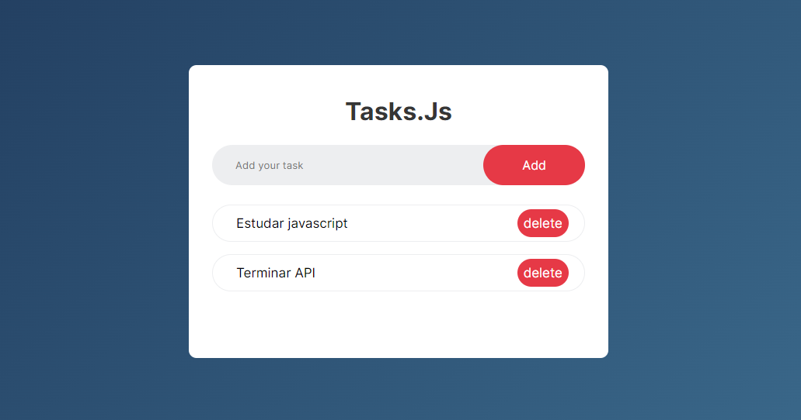

<h1 align="center"> Tasks.js </h1>

Site simples de lista de tarefas (ToDo App) construído com HTML, CSS e JavaScript.

 

  

## Tecnologias

Esse projeto foi desenvolvido com as seguintes tecnologias:

- HTML e CSS
- JavaScript
  
## 💻 Projeto

Tasks.js é um To-Do app para gerenciamento de suas tarefas. As tarefas ficam salvas no localStorage para serem acessadas mesmo após fechamento do site.

- [Acesse o projeto finalizado, online](https://maykbrito.github.io/devlinks)
